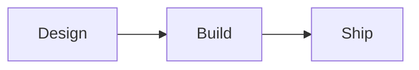

# note-buddy

Two small local tools that turn things you've read or written into permanent,
searchable notes and Anki flashcards. Both authenticate through your existing
[Claude Code](https://claude.com/claude-code) subscription — no API key needed.

| Tool | What it does |
|---|---|
| [`pipeline`](#the-handwritten-note-pipeline) | Photographed handwritten page → Markdown note in Obsidian (always) + Anki cards (when the page asks for them). |
| [`danki.py`](#danki--url--pdf--text--anki-cards) | URL, PDF, or pasted text → reviewed Anki cards. |

Full architecture diagram: [`docs/data-flow.svg`](docs/data-flow.svg) (source:
[`docs/data-flow.mmd`](docs/data-flow.mmd)).

Licensed [MIT](LICENSE). Security notes and threat model:
[`SECURITY.md`](SECURITY.md).

---

# The handwritten-note pipeline

Photograph a handwritten page, run one command, and get a permanent, linked note
in your Obsidian vault — plus Anki flashcards when you asked for them.

```
[ Source ] ──> [ Transcriber ] ──> [ Sink(s) ]
  local dir       Claude            Obsidian  (always)
                                    Anki      (when the page says so)
```

Re-runs are safe: every image is recorded by content hash, so nothing is ever
transcribed twice, and renaming a photo doesn't cause reprocessing.

Each note keeps its provenance: the source photo is copied into the vault and
embedded at the bottom under a `## Source` section, and hand-drawn diagrams are
digitized as mermaid code blocks so they render as real diagrams in Obsidian.

---

## 1. Prerequisites

| What | Why | Notes |
|---|---|---|
| **Python 3.11+** | the pipeline | `python3 --version` |
| **A Claude Code login** | transcription | Install the `claude` CLI and run `claude` once to sign in with your Claude subscription. No API key needed — auth piggybacks on that login. |
| **An Obsidian vault** | where notes land | any existing vault; the pipeline writes into one folder inside it |
| **Dataview plugin** | the dashboards | Obsidian → Settings → Community plugins → browse → *Dataview* → Install → Enable |
| **Anki + AnkiConnect** | flashcards, optional | AnkiConnect add-on code **`2055492159`** (Tools → Add-ons → Get Add-ons) |

**Dataview is not optional if you want the dashboards to work.** Without it,
`Handwritten Notes.md`, `Review Queue.md`, `Weekly Digest.md` and the index notes
render as plain code blocks rather than live tables. The notes themselves are
perfectly readable either way — only the dashboards need it.

Anki is fully optional. With Anki closed the run still completes and every
Obsidian note is written; the Anki side is marked as failed and can be picked up
later with `--retry-failed`.

## 2. Install

Clone the repo, make a venv, and install. Two supported paths:

**Reproducible install** — the exact set of package versions this project was
last tested against, pinned in `requirements.txt`:

```bash
git clone https://github.com/<you>/note-buddy.git
cd note-buddy
python3 -m venv .venv && source .venv/bin/activate
pip install -r requirements.txt   # pinned transitive deps
pip install -e .                   # then install this project itself, editable
cp config.example.yaml config.yaml
```

**Development install** — floating versions, driven only by `pyproject.toml`
(useful if you're upgrading a dependency and want to see what breaks):

```bash
python3 -m venv .venv && source .venv/bin/activate
pip install -e .
cp config.example.yaml config.yaml
```

`config.yaml` is gitignored — it holds your paths, not your secrets. There is no
API key to keep out of it.

### Optional: PDF support for `danki.py`

`danki.py` imports [`pypdf`](https://pypi.org/project/pypdf/) lazily, only if
you feed it a PDF. `requirements.txt` already pins it; if you installed only
via `pip install -e .` and want PDF support, add it explicitly:

```bash
pip install pypdf
```

### Refreshing the lock file

If you change a direct dependency in `pyproject.toml`, regenerate the pins:

```bash
pip install -e .                                          # install the change
pip freeze | grep -v '^-e ' | grep -v '^# Editable' \
    > requirements.txt                                    # re-lock
```

## 3. Configure

Open `config.yaml`. Every key, in order:

### `claude`

| Key | Default | What it does |
|---|---|---|
| `model` | `claude-haiku-4-5` | Any Claude model with vision. A bare alias (`haiku`, `sonnet`, `opus`) tracks the current generation; a full id like `claude-sonnet-5` pins one. Haiku is fast/cheap and reads tidy handwriting well; switch to `sonnet` for tough handwriting, or `opus` for the best reads at the highest cost. |

Auth piggybacks on your Claude Code login. Make sure the `claude` CLI is on
`PATH` and you've run `claude` at least once to sign in. There is no env var to
set.

### `source`

| Key | Default | What it does |
|---|---|---|
| `type` | `local` | Only `local` ships today. See [Extending](#9-extending). |
| `path` | `~/Pictures/Handwritten` | Directory of photos, searched **recursively**. `png jpg jpeg webp gif heic heif`. |

HEIC works: Claude accepts `image/heic` directly, so iPhone photos need no
conversion step.

### `state_dir`

Where `ledger.json` lives (default `~/.handwritten-pipeline`). The ledger is the
record of what has already been processed. Delete it and the next run
re-transcribes everything — see [Troubleshooting](#10-troubleshooting).

### `sinks`

The destinations, **in run order**:

```yaml
sinks:
  - obsidian    # must be first
  - anki
```

`obsidian` must come first. The Anki sink reads the Obsidian note's path from the
preceding outcome to build the `obsidian://` back-link on each card. The
pipeline refuses to start if the order is wrong. Drop `anki` from the list to
turn flashcards off entirely.

### `obsidian`

| Key | Default | What it does |
|---|---|---|
| `vault_path` | `~/Obsidian/MyVault` | The vault folder on disk — the one containing `.obsidian/`. |
| `vault_name` | `MyVault` | The vault's **display name**, as it appears in Obsidian's vault switcher. Used to build `obsidian://open?vault=…` links on Anki cards. If it's wrong, cards still work but their "Source note" link won't open. Usually the same as the folder name. |
| `root_folder` | `Handwritten Notes` | Everything the pipeline writes lives under this folder inside the vault. Nothing outside it is ever touched. |
| `create_daily_notes` | `false` | Notes link to `[[2026-07-31]]` regardless. Leave this off if you have a daily-notes plugin that owns those files — otherwise the pipeline will create stubs alongside them. |
| `daily_notes_folder` | `""` | Where those stubs go, relative to the vault. `""` means the vault root. |
| `link_attendees` | `true` | Create `People/<name>.md` pages and link attendees from each note. |

#### Filenames, headings, and provenance

- **Filename slug.** If the transcribed body starts with a `# Heading`, that
  heading text becomes the filename slug (`{date}-{slugified-heading}.md`) and
  the note's title. Otherwise the pipeline falls back to the LLM-extracted
  `Subject:` label, and finally to `misc`.
- **No double H1.** When the body already leads with a heading, the pipeline
  does not add a redundant title line above it.
- **Source photo, always at the bottom.** The original image is copied into
  `<root_folder>/attachments/<filename>` (idempotent) and embedded under a
  `## Source` section at the end of every note, so you can always glance back
  at the page the transcription came from.
- **Hand-drawn diagrams become mermaid.** Flowcharts, sequence diagrams, mind
  maps, quadrants, timelines, org charts, state machines, and simple pie/bar
  charts are transcribed as ```` ```mermaid ```` code blocks at the same
  position in the body where they appear on the page. Obsidian ≥ 1.4 renders
  them natively, so hand-drawn boxes-and-arrows become real diagrams you can
  edit. Freeform sketches, doodles, and annotated photos that don't fit a
  mermaid type fall back to a `> [!note] Diagram` callout describing the
  visual — the source image at the bottom is the ground truth.

### `anki`

| Key | Default | What it does |
|---|---|---|
| `enabled` | `true` | Master switch. `false` skips every page. |
| `deck_template` | `"Handwritten::{type_folder}"` | `::` is Anki's deck hierarchy. Variables: `{type}` `{type_folder}` `{subject}` `{date}`. `type_folder` is `book→books`, `1:1→1on1`, `meeting→meetings`, `notes→misc`. |
| `max_cards_per_note` | `20` | Hard cap per page. |
| `sync_after_run` | `true` | Push to AnkiWeb once at the end of the run, and only if cards were actually added. |
| `connect_url` | `http://127.0.0.1:8765` | Where AnkiConnect listens. |

### `tags`

| Key | Default | What it does |
|---|---|---|
| `allow_new` | `true` | May the model propose a tag that isn't in the vocabulary? If `false`, unmatched tags are dropped. |
| `max_per_note` | `5` | Truncation limit. |
| `vocabulary` | 13 starter topics | The controlled list, injected into the prompt. See [Adding a tag](#8-adding-a-tag). |

## 4. First run

Nothing to export — as long as `claude` is on `PATH` and you're signed in, the
pipeline can call it. (If you keep unrelated env in a `.env` next to `run.sh`,
the wrapper still loads it.)

Look before you leap. `--dry-run` lists what *would* be processed and calls
nothing, which is the cheap way to sanity-check a directory before spending
subscription usage on 200 photos:

```bash
./run.sh run --path ~/Pictures/Handwritten --dry-run
```

```
would process IMG_4821.heic  [081f83b7c54b]
would process IMG_4822.heic  [9e2505d820a1]

dry run: 2 would be processed · 0 already done
```

Then the real thing:

```bash
./run.sh run --path ~/Pictures/Handwritten
```

```
transcribing IMG_4821.heic ...
  obsidian: ok (Handwritten Notes/1on1/2026-07-31-weekly-checkin.md)
  anki: skipped (not requested)
transcribing IMG_4822.heic ...
  obsidian: ok (Handwritten Notes/misc/2026-07-31-raft-consensus.md)
  anki: ok (6 cards -> Handwritten::misc)

2 processed · 0 skipped (already done) · 0 flagged for review · 0 errors
6 Anki card(s) added
note: Synced with AnkiWeb.
```

Above 50 pending images the run stops and asks for `--yes`, so a first run
against a photo library full of receipts can't quietly bill you for 2,000
transcriptions. `--max-images N` does a batch at a time instead.

## 5. What lands where

```
MyVault/
└── Handwritten Notes/
    ├── Handwritten Notes.md      ← main dashboard, start here
    ├── Review Queue.md           ← pages Claude struggled with
    ├── Weekly Digest.md          ← the last 7 days
    ├── Indexes/
    │   ├── Books.md  1on1s.md  Meetings.md  Misc.md
    │   └── Topics.md             ← tag rollup
    ├── People/
    │   └── Alex R.md             ← every note this person appears in
    ├── attachments/
    │   └── IMG_4821.heic         ← originals, one per processed page
    ├── books/
    ├── 1on1/
    │   └── 2026-07-31-weekly-checkin.md
    ├── meetings/
    └── misc/
```

Notes are named `<date>-<slug>.md`, where the slug comes from the body's leading
`# Heading` if present, else the `Subject:` label, else `misc`. An existing note
is **never** overwritten — a collision gets `-2`, `-3`, and so on.

An example note:

````markdown
---
date: 2026-07-31
type: "1:1"
subject: weekly checkin
attendees: [Alex R]
tags: [management, feedback]
source_image: IMG_4821.heic
image_hash: 081f83b7c54bdeacc74071b5a6e0af9becb42ee0cf5ae9085e388e15f285d516
transcribed_at: "2026-08-01T13:14:22"
model: claude-haiku-4-5
needs_review: false
review_reason: null
anki_deck: null
anki_note_ids: []
---

# Weekly checkin

> [!summary] TL;DR
> Discussed Q3 priorities and the billing-API dependency risk.

**Date:** [[2026-07-31]] · **Type:** [[1on1s]] · **With:** [[Alex R]]

---

- Q3 priorities are locked
- billing-API is the long pole



---

## Source

![[Handwritten Notes/attachments/IMG_4821.heic]]
````

The frontmatter is the load-bearing part — every dashboard query reads it. The
link line underneath is for clicking through. Anything hand-drawn on the page
becomes a mermaid block inline (or a `> [!note] Diagram` callout if it's too
freeform), and the original photograph sits at the bottom for cross-reference.

Hub and index notes are created only when missing. Once a file exists the
pipeline leaves it alone, so you can add your own content to any dashboard
without it being overwritten. (To regenerate one from the template, delete it
and run `rebuild-hubs`.)

## 6. How to mark a page for Anki

Write **`Anki`** anywhere on the page. The transcriber looks for the literal
word — in the header block, circled in a corner, scrawled in the margin. It does
not guess based on content.

Pages typed `notes` also produce cards without the marker, on the theory that
that's what a page of study notes is for.

The header block the transcriber expects, on the first lines of the page:

```
Date: 2026-07-31
Type: 1:1
Attendees: Alex R, Sam T
Subject: weekly checkin
Anki: yes
```

Every line is optional:

- **`Date:`** — missing or unreadable falls back to today.
- **`Type:`** — one of `book`, `1:1`, `meeting`, `notes`. Anything else becomes
  `notes`. This picks the folder and the deck.
- **`Attendees:`** — comma-separated. Each name gets a `People/` page and a
  wikilink.
- **`Subject:`** — fallback for the filename slug and note title when the body
  has no leading `# Heading`. Missing → `misc`. See [Filenames, headings, and
  provenance](#filenames-headings-and-provenance).
- **`Anki:`** — any appearance of the word turns cards on.

Header lines are stripped from the note body.

Cards get the note's topic tags plus `handwritten` and `note::<date>-<subject>`,
so you can study by topic in Anki and find every card that came from one page.
Each card's back ends with a **Source note** link that opens the note in
Obsidian, and the note's frontmatter is updated with `anki_deck` and
`anki_note_ids`. A note that produces no memorizable facts — most meeting
recaps — produces no cards, and that's a normal outcome, not an error.

## 7. Daily use

```bash
./run.sh run                          # process everything new
./run.sh run --since 7d               # ...modified in the last week (also 24h, 2w, 2026-07-01)
./run.sh run --dry-run                # list, don't call Claude
./run.sh run --max-images 10          # a batch at a time
./run.sh status                       # counts, last run, review queue size
./run.sh rebuild-hubs                 # recreate any missing dashboard or index
```

`--since` filters by file modified time. It applies *in addition to* the ledger,
never instead of it — the ledger is the only thing preventing duplicates.

**Recipes**

Redo one page (the ledger forgets it; the next run picks it up):

```bash
./run.sh reprocess IMG_4821.heic      # also accepts a full path or a hash prefix
./run.sh run
```

The old note is left in place, so this writes `…-2.md` next to it. Delete the
old note first if you want a clean replacement.

Redo everything in a directory, ignoring the ledger entirely:

```bash
./run.sh run --path ~/Pictures/Handwritten --force --yes
```

Pick up work that failed because Anki was closed, or because Claude errored:

```bash
./run.sh run --retry-failed
```

Retries only re-run the sinks that failed. A note that was already written to
Obsidian is not written again.

Transcribe a single image without touching the vault or the ledger:

```bash
python -m pipeline.transcribe photo.heic
python -m pipeline.transcribe photo.heic --route --notes-dir ~/notes
```

## 8. Adding a tag

One line in `config.yaml`:

```yaml
tags:
  vocabulary:
    - architecture
    - observability      # ← new
```

The vocabulary is injected into the transcription prompt, so the model picks
from it rather than inventing something new each time. Whatever comes back is
lowercased, kebab-cased, de-duplicated, and folded onto the list where it's
close enough — `software-architecture` becomes `architecture`, `databse` becomes
`databases`. With `allow_new: true`, a genuinely new tag is kept and the run
prints:

```
note: new tag proposed: 'observability' -- add to config.yaml to keep it stable
```

Take the hint and add it, or the next page on the topic may word it differently.
With `allow_new: false`, unmatched tags are dropped.

## 9. Extending

The core contract is two methods. A source yields images; a sink accepts a
result. Neither knows the other exists.

**A new source** — `pipeline/sources/onedrive.py`:

```python
class OneDriveSource:
    name = "onedrive"

    def list_images(self, since=None):
        for item in my_api.list_photos(modified_after=since):
            yield SourceImage(
                id=f"onedrive:{item.id}",
                filename=item.name,
                mime_type=item.mime,
                modified_at=item.modified,
                read=lambda item=item: my_api.download(item.id),  # lazy!
            )
```

Register it in `build_source()` in `pipeline/sources/__init__.py`. `read` must
stay lazy — listing 2,000 photos must not download 2,000 photos.

**A new sink** — `pipeline/sinks/readwise.py`:

```python
class ReadwiseSink:
    name = "readwise"

    def accepts(self, result):
        return result.type == "book"          # the routing rule lives here

    def store(self, result, prior):
        highlight_id = my_api.push(result.subject, result.body_markdown)
        return SinkOutcome("readwise", "ok", {"id": highlight_id})
```

Register it in `build_sinks()` in `pipeline/sinks/__init__.py` and add its name
to `sinks:` in the config. `prior` holds the outcomes of sinks that already ran
this image, which is how the Anki sink finds the Obsidian note to link back to.

Sinks must not raise for expected conditions — return a `SinkOutcome` with
status `"error"` or `"skipped"` and a `reason`. The orchestrator catches
exceptions anyway, but the outcome detail is what lands in the ledger and the
run summary.

## 10. Troubleshooting

**"Anki is not running; N notes skipped Anki output"**
Anki must be open with the AnkiConnect add-on installed for cards to land. The
Obsidian side of the run succeeded regardless. Open Anki and run
`./run.sh run --retry-failed`.

**Dashboards show a code block instead of a table**
The Dataview plugin isn't installed or isn't enabled. Settings → Community
plugins → Dataview.

**Dashboards are empty but notes exist**
Check `root_folder` in `config.yaml` matches the folder the queries point at
(`FROM "Handwritten Notes"`). If you changed `root_folder` after the hubs were
created, delete the hub notes and run `./run.sh rebuild-hubs`.

**Duplicate cards**
AnkiConnect refuses a card whose front matches an existing note. The pipeline
counts those and carries on — the run summary reports `N duplicate`. Nothing is
lost; the original card is still there.

**A page came out wrong / the header wasn't read**
It'll be in `Review Queue.md` if Claude knew it struggled. Fix the photo (better
light, whole page in frame), then:

```bash
./run.sh reprocess IMG_4821.heic && ./run.sh run
```

If Claude read it confidently but wrongly, just edit the note. The pipeline is
one-directional and never touches a note again after it's written.

**Start over**
The ledger lives at `<state_dir>/ledger.json` (default
`~/.handwritten-pipeline/ledger.json`). Delete it and everything is reprocessed
on the next run — which will create `-2` copies of notes that already exist, so
clear out the vault folder too if you want a truly clean slate.

**Nothing happens / "0 processed · N skipped"**
Everything in the directory is already in the ledger. That's the normal steady
state. Use `--force` to redo, or `reprocess` for one page.

---

## Notes on the design

- **Content hashing, not timestamps.** The output filename isn't known until
  after Claude runs, so a directory scan can't tell what's been done. Hashing
  the bytes also means renaming or moving a photo doesn't cause reprocessing.
- **Two photos of one continued note become two notes.** Detecting continuation
  is out of scope; give the pages the same top heading and a `(part 2)` suffix
  if you want them adjacent in the folder.
- **No daemon, no watcher, no sync-back.** On-demand runs only, one direction
  only.
- The original vision call used Google Gemini; the pipeline now calls Claude
  through the `claude-agent-sdk`, which piggybacks on your local Claude Code
  login. The only file that talks to the model is `pipeline/llm.py`; swapping
  provider again would touch just that.

---

# danki — URL / PDF / text → Anki cards

A standalone companion CLI that turns anything you've just read into reviewed
Anki flashcards. Point it at a URL, a PDF, a Markdown file, or pasted text; it
extracts the durable, worth-remembering bits, shows you the proposed cards, and
pushes the ones you keep into Anki.

`danki.py` is intentionally **standalone** — a single 999-line script, no
dependencies beyond the Python standard library (plus `pypdf`, imported lazily
if you feed it a PDF). Copy it anywhere and run it; it does not import from
`pipeline/`.

## Prerequisites

Same as [the pipeline](#1-prerequisites), plus:

- `pypdf` if you plan to feed it PDFs: `pip install pypdf`. Every other input
  mode works without it.

## Quickstart

```bash
# From a URL
python danki.py https://example.com/article

# From a PDF
python danki.py ~/Downloads/paper.pdf

# From a Markdown or text file
python danki.py notes.md

# From stdin
pbpaste | python danki.py -

# From an editor buffer
python danki.py --paste
```

Claude proposes cards; you review them one-by-one (or with `--step` for a
prompted walkthrough) and press `y`/`n` on each. Accepted cards land in the
`danki::<topic>` deck by default, tagged with whatever topic tags Claude
inferred, and each card back gets a footer linking back to the source URL or
file so you can re-read the context later.

## Options that matter

```bash
python danki.py URL_OR_FILE [options]
```

| Flag | Default | What it does |
|---|---|---|
| `--paste` | off | Opens `$EDITOR` to type/paste content instead of reading a file or URL. |
| `--model MODEL` | `sonnet` | Claude model to use (`sonnet`, `haiku`, `opus`). |
| `--max-cards N` | `20` | Cap on the number of cards Claude proposes. |
| `--max-chars N` | `60000` | Truncate input to N characters before sending. `0` disables. |
| `-y`, `--yes` | off | Accept every card; skip the interactive picker. |
| `--step` | off | Review one card at a time with a full prompt. |
| `--deck NAME` | `danki` | Top-level deck; each source becomes a `NAME::<topic>` sub-deck. |
| `--topic NAME` | (Claude picks) | Override the sub-deck name Claude inferred. |
| `--tags TAG …` | `[]` | Extra tags added to every card. |
| `--sync` | off | Push to AnkiWeb after adding cards. |
| `--no-footer` | off | Omit the source-link footer on each card's back. |
| `--dry-run` | off | Show the accepted cards and exit without touching Anki. |
| `--dump-text` | off | Print the extracted text (post-truncation) and exit. |
| `--cards-json PATH` | — | Skip Claude entirely and load a saved proposal from disk. |
| `--connect-url URL` | `http://127.0.0.1:8765` | AnkiConnect endpoint. |
| `--claude-bin PATH` | `claude` | Path to the `claude` executable. |
| `--timeout N` | `300` | Claude call timeout in seconds. |
| `--fetch-timeout N` | `20` | URL fetch timeout in seconds. |
| `-q`, `--quiet` | off | Suppress Claude's timing/cost line. |

## What Claude keeps and what it drops

The prompt (see `CARD_PROMPT` in `danki.py`) tells Claude to keep only
high-value, durable information — key claims, principles, heuristics, mental
models, concrete facts, causal explanations, actionable practices. It is
told to **exclude** anecdotes, biography, chit-chat, subscription boilerplate,
navigation text, and anything only meaningful while reading. For a purely
narrative or logistical source, an empty card list is a correct answer.

Each card is atomic (one idea per card), short-backed, and drawn only from the
source text — no outside knowledge.

## What happens when Anki isn't running

If AnkiConnect isn't reachable, `danki` prints the accepted proposal as JSON so
you can pipe it into a file and re-run later with `--cards-json`:

```bash
python danki.py https://example.com/article > /tmp/proposal.json
# ...open Anki, install AnkiConnect...
python danki.py --cards-json /tmp/proposal.json https://example.com/article
```

The same escape hatch is useful for retrying without spending another Claude
call if you accidentally reject a card you wanted.

## When to use which

|  | Use `pipeline` | Use `danki.py` |
|---|---|---|
| Source | Photograph of a handwritten page | URL, PDF, text file, stdin, or `--paste` |
| Output | Obsidian note (always) + Anki cards (conditional) | Anki cards only |
| Batch mode | Yes (whole directories, ledger-backed) | No (one input at a time) |
| Card review | Automated; every card that comes back is added | Interactive picker; you accept per card |
| Long-term storage | Yes, in your vault | No — Anki only |

The pipeline is for **your own writing**; `danki` is for **other people's
writing** that you want to remember.
