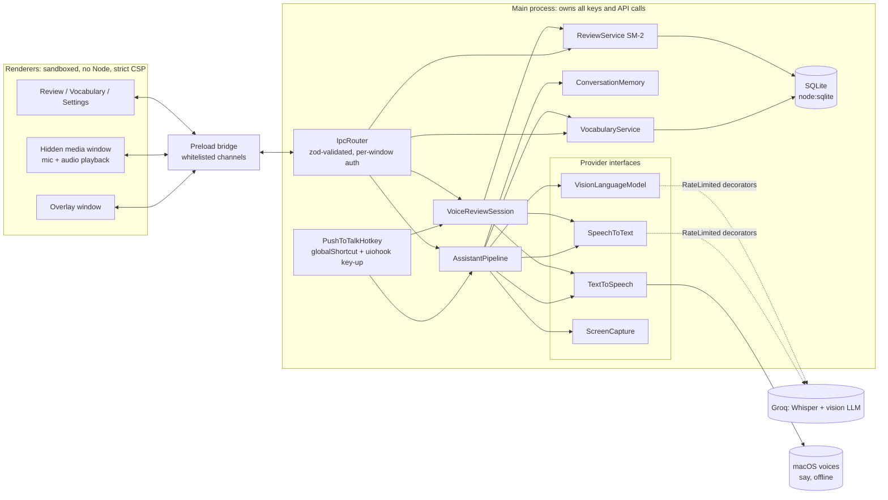
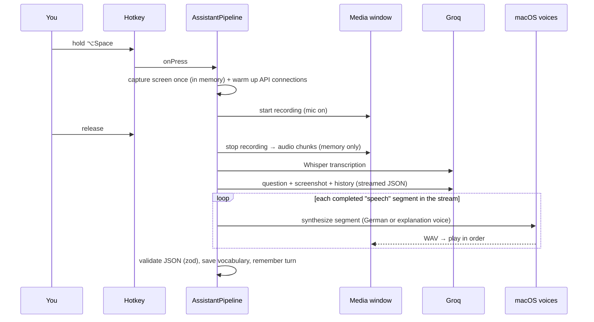

# D-Learn

**A screen-aware, voice-first German study companion for macOS.**

While you study anything on your screen (a YouTube video, Nicos Weg, a PDF, a website), hold a hotkey and
ask a question out loud. D-Learn looks at your screen at that moment and answers by voice and in a small
overlay: German read by a German voice, explanations in English or Arabic, adapted to your level. Every word
you ask about lands in a vocabulary deck with spaced-repetition review.

**A complete course from A2 to B2**, not just a helper: a daily plan, a grammar course from A1 to B2, core
vocabulary by theme, Goethe-style writing with corrections, spoken role-plays, dictation, a mistake notebook and
progress tracking — see **[the 8-month B2 plan](docs/B2_PLAN.md)** and **[how D-Learn teaches](docs/LEARNING.md)**.

**100 % free to run:** speech-to-text and the vision model use Groq's free tier (one free API key), and the voices
are the ones built into macOS (offline, no key, no quota). No paid or credit-card services.

<p align="center">
  
</p>

<p align="center">
  
</p>

<p align="center">
  
  
  </p>

<p align="center">
  
</p>

<p align="center">
  
</p>

> 🎬 A demo video/GIF is coming (`docs/demo.gif`). Screenshots were taken in demo mode (`DLEARN_DEMO=1`).

```
"What does Verabredung mean?"        "Why is it dem and not den here?"
"Read this sentence aloud slowly."   "Is my answer in this exercise correct?"
"Give me another example with that word."
```

## Features

### The course (Study window)

- **Today:** your goal (B2 by a date), today's plan sized to your daily minutes — reviews, new words, grammar,
  writing or speaking (alternating), dictation and real German input — with measured study time and the current
  phase of the [8-month roadmap](docs/B2_PLAN.md).
- **Grammar:** 48 topics from A1 to B2 in teaching order. Each has a short lesson written for your level, exercises
  (gap, transform, translate, find the mistake) graded instantly, and spaced refreshers. "I already know this" and
  first-try placement skip what you know.
- **Writing:** Goethe-style tasks (messages, e-mails, forum posts, opinion pieces) corrected like an examiner would:
  corrected text, every error with its rule, scores for task, coherence, vocabulary and grammar, and a level estimate.
- **Speaking:** role-plays for real situations and the Goethe B1/B2 speaking parts. D-Learn plays the other person
  in German; answer with your hotkey (or type). Gentle corrections as you go, feedback at the end.
- **Listening:** dictation from your own sentences — listen (normal or slow), type, see a word-by-word comparison.
- **Mistake notebook:** every error from writing, speaking and grammar practice becomes a "fix this sentence" card.
- **Made to stick and fun to repeat:** FSRS scheduling (the modern Anki algorithm) at your chosen recall target,
  typed answers with automatic grading, every word spoken as you review, 🧠 memory hooks (keyword method) for
  tricky words, mini-stories with your recent words, streaks, milestones, session celebrations and a daily reminder.
- **Core vocabulary:** high-frequency words by Goethe theme for your level, on top of words from your screen.
- **Progress:** estimated level per skill, vocabulary size against rough CEFR benchmarks, grammar per level,
  weekly study hours.

### On-screen help

- **Push-to-talk** on a global hotkey (default: hold <kbd>⌥ Space</kbd>, configurable). Press = screenshot of the
  display under the cursor + microphone on; release = answer.
- **Speaks your language(s):** ask in English, German or Arabic, or mix them (Groq Whisper, auto-detected).
- **Sees your screen:** your question and the screenshot go to a vision model (Groq `qwen/qwen3.8-27b`).
- **Answers by voice, sentence by sentence:** German in a German voice, explanations in an English or Arabic voice,
  using the free macOS system voices (offline; the free "Premium" voices sound close to neural TTS). Speech starts
  as soon as the first sentence is ready.
- **Overlay:** small, always-on-top, draggable, dismissable panel with your question and the answer, which appears
  **live while it is spoken**; German words highlighted; saved words colour-coded by gender; **🔊 replay** the last
  answer; auto-hides (pauses while hovered); right-to-left layout for Arabic.
- **Follow-ups:** questions within a few minutes keep the context ("give me another example with that word").
- **Automatic vocabulary deck:** every German word you ask about is saved dictionary-style — nouns with article
  and plural (`die Verabredung, -en`), verbs with their principal parts (`fährt · fuhr · ist gefahren`), the case a
  word governs (`mit + Dativ`), a CEFR estimate, an example, and **the real sentence from your screen** — de-duplicated.
- **Colour-coded genders** everywhere: **der** blue, **die** red, **das** green.
- **Review built on learning science** ([how D-Learn teaches](docs/LEARNING.md)): each word becomes up to four
  cards — _recognition_, _say it in German_ (with the article), _der/die/das_ and _fill the gap_ (from the sentence
  on your screen). Harder directions unlock the day after you first recognise a word; new cards per day are capped;
  SM-2 spacing with the next interval on every grade button; gender rules of thumb with flagged exceptions
  (_-ung → die_); "tricky" words (leeches) get flagged; a 🔥 daily streak. All of it also works **by voice**:
  D-Learn asks, you hold the hotkey and answer.
- **Explanations that grow with you:** in your language at A1–A2, mixed at B1, simple German from B2 (adjustable),
  reusing words you learned recently.
- **Menu bar app** with a status icon: idle ◯, listening 🔴 **REC**, thinking ⋯, speaking ◉, paused ⊘.
- **Settings:** level (A1–C2), explanation language, hotkey and mode, voices, overlay behaviour, capture area and
  size, conversation memory, **privacy pause**.

## How it works



One question, end to end:



**Design notes** (details and alternatives in [DECISIONS.md](DECISIONS.md)):

- **Dependency inversion:** the pipeline and review logic depend only on `SpeechToText`, `VisionLanguageModel`,
  `TextToSpeech`, `ScreenCapture`, `AudioRecorder`, `AudioPlayer`. Real adapters (Groq, macOS `say`, Electron) are wired in
  one composition root ([`src/main/App.ts`](src/main/App.ts)); tests use fakes.
- **Decorators:** client-side rate limiting wraps any provider without either side knowing.
- **Open/closed language profiles:** everything German-specific (articles, plural compression like `Haus → ¨-er`,
  voices, CEFR levels, prompt guidance) lives in [`profiles/german.ts`](src/shared/languages/profiles/german.ts).
  Adding a language = adding one file; the registry discovers it.
- **Structured output:** the model returns JSON validated with zod (`speech[]`, `answer`, `vocabulary[]`);
  invalid output triggers one repair request with the validation error.
- **Streaming TTS:** a small tokenizer pulls completed `speech` segments out of the partial JSON stream, so the
  first sentence is spoken while the model is still writing the rest.
- **Null objects:** without API keys the app still runs (review, vocabulary) and explains what's missing.

## Setup

Requirements: macOS (Apple Silicon or Intel), [nvm](https://github.com/nvm-sh/nvm) and a free
[Groq API key](https://console.groq.com/keys). That's the only account needed.

```bash
git clone https://github.com/kioxr/D-Learn.git
```

```bash
cd D-Learn && nvm install && nvm use && npm ci
```

```bash
cp .env.example .env
```

Put your `GROQ_API_KEY` in `.env`, then:

```bash
npm run dev
```

D-Learn appears in the menu bar (no Dock icon). On first use macOS asks for:

| Permission       | Why                                               | Where                                                 |
| ---------------- | ------------------------------------------------- | ----------------------------------------------------- |
| Microphone       | hear your question, only while the hotkey is held | System Settings → Privacy & Security → Microphone     |
| Screen Recording | see the screen at the moment you press the hotkey | … → Screen Recording (restart D-Learn after granting) |
| Accessibility    | detect the hotkey **release** for hold-to-talk    | … → Accessibility                                     |

Without Accessibility the hotkey still works in **toggle mode** (press to start, press again to stop). In
development the permissions are requested for "Electron"; the packaged app asks for "D-Learn".

## Configuration

| Variable                | Required | Default                  | Purpose                                                          |
| ----------------------- | -------- | ------------------------ | ---------------------------------------------------------------- |
| `GROQ_API_KEY`          | yes      | —                        | Whisper STT and the vision model                                 |
| `GROQ_VISION_MODEL`     | no       | `qwen/qwen3.8-27b`       | any Groq model with image input                                  |
| `GROQ_TEXT_MODEL`       | no       | `openai/gpt-oss-120b`    | tutor model for lessons, grading, writing, conversation          |
| `GROQ_STT_MODEL`        | no       | `whisper-large-v3-turbo` | or `whisper-large-v3`                                            |
| `GROQ_REASONING_EFFORT` | no       | `low`                    | `none`/`low`/`medium`/`high`, or `default` to omit the parameter |
| `DLEARN_LOG_LEVEL`      | no       | `info`                   | `debug` for more detail                                          |

**Voices** need no configuration: _Best available_ picks the best installed macOS voice for German, English and
Arabic (Premium > Enhanced > standard; novelty voices are never chosen). For much better quality, download free
voices in **System Settings → Accessibility → Spoken Content → System Voice → Manage Voices…** (recommended:
German _Anna (Premium)_ or _Petra (Premium)_, English _Ava (Premium)_ or _Zoe (Premium)_, Arabic _Majed (Enhanced)_),
then use **▶ Test** in D-Learn's Settings.

**Where the key is read from:** in development `./.env` and then
`~/Library/Application Support/D-Learn/.env`; the **packaged app** reads only
`~/Library/Application Support/D-Learn/.env`. Real environment variables override both. Keys are validated at
startup; if any is missing, the Settings window opens and lists exactly what's missing.

Everything else (level, explanation language, hotkey, voices, overlay, capture, memory, privacy pause) is in the
Settings window and stored in `~/Library/Application Support/D-Learn/settings.json`. The vocabulary lives in
`d-learn.sqlite` in the same folder.

## Privacy and security

- **Screen:** captured once, at the moment you press the hotkey — never continuously, never in the background.
  The screenshot is kept in memory, sent to the model, and discarded (the last one is kept in memory for a few
  minutes for follow-ups). It is written to disk only if you enable _Save screenshots (debug)_.
- **Audio:** recorded only while the hotkey is held (max 30 s), streamed to the main process in memory, sent for
  transcription, never stored. The microphone is opened on press and closed on release.
- **Visible state:** the menu bar icon turns red with **REC** whenever the microphone is on.
- **Privacy pause** unregisters the hotkey entirely (a recording in progress is discarded, not sent) and clears
  the conversation memory.
- **Electron hardening:** `contextIsolation`, `sandbox`, no `nodeIntegration`, a minimal typed preload bridge, strict
  CSP (`default-src 'none'`, no inline scripts or styles), navigation and `window.open` blocked, all permissions
  denied except audio for the hidden media window. Every IPC message is validated with zod and checked against the
  window allowed to send it.
- **Keys:** only the main process holds API keys; renderers never see them. Logs redact secret-looking fields,
  mask registered key values anywhere in a message and never contain screenshots or audio.
- **Quotas:** per-request timeouts (STT 20 s, LLM 30 s, speech 15 s) and client-side rate limits well below Groq's
  free tier, so a bug can't drain it. Speech is synthesized locally, so answers are never sent to a TTS service.

## Latency

Every turn logs per-stage timings (`Turn timings (ms)` in the console) and the Settings window shows medians of
the last 20 turns. Stages: `capture`, `recordStop`, `stt`, `llmFirstToken`, `llm`, `firstAudio` (release → first
sound), `speaking`, `total`.

Measured from the development Mac (Apple Silicon, macOS 26.6) on 2026-09-26, before any API keys were configured
(5 requests each, median):

| What                                                            | Measured                                         |
| --------------------------------------------------------------- | ------------------------------------------------ |
| Cold HTTPS request to `api.groq.com` (connect + TLS + response) | ~540 ms (TLS ≈ 250 ms of it)                     |
| macOS voice, one sentence → WAV (Samantha / Majed / Anna)       | ~450–550 ms (first call +~500 ms to list voices) |

Because Node's `fetch` drops idle connections after a few seconds, D-Learn **pre-warms the connection to Groq
when you press the hotkey** (credential-free `HEAD` requests), so the handshake happens while you are still speaking.

End-to-end numbers with real keys (fill in after the first sessions; see [TODO_FOR_AHMAD.md](TODO_FOR_AHMAD.md)):

| Stage                              | Median |
| ---------------------------------- | ------ |
| capture                            | _tbd_  |
| stt                                | _tbd_  |
| llmFirstToken                      | _tbd_  |
| firstAudio (release → first sound) | _tbd_  |
| total                              | _tbd_  |

Screenshots are downscaled to a 1600 px long edge and JPEG-encoded (quality 80) — about 150–350 KB, still sharp
enough for subtitles and exercise text. The _region around the cursor_ capture mode keeps small text sharper and
sends less, at the cost of context outside the region.

## Development

```bash
npm run check
```

runs ESLint, both TypeScript projects (main/preload and renderers) and the Vitest suite (220+ tests). Other scripts:
`npm run dev`, `npm test`, `npm run test:watch`, `npm run format`, `npm run build`, `npm run icons`.

**Demo mode** (for screenshots and recordings, no key or permissions needed; the study screens use a scripted tutor):

```bash
DLEARN_DEMO=1 DLEARN_USER_DATA=/tmp/dlearn-demo npm run dev
```

It uses a throwaway data folder, seeds a few words and shows a sample answer in the overlay.

Tests cover the conversation flow (with fake providers), streaming speech extraction, JSON validation and repair,
vocabulary extraction and de-duplication, German noun formatting, SM-2 scheduling, voice review, settings parsing,
language profiles, the IPC contract and router authorisation, the hotkey state machine, rate limiting, HTTP error
mapping, provider request shapes (with a fake `fetch`), log redaction and SQLite migrations. External APIs are never
called by tests.

CI (GitHub Actions) runs lint, format check, typecheck, tests and a build on every push and pull request, and
packages the `.dmg` on pushes to `main`.

### Project structure

```
src/
  main/            Electron main process (all API calls and keys live here)
    App.ts         composition root
    audio/         IPC recorder + player (mic/playback run in the media window)
    capture/       one-shot screen capture, image sizing
    config/        .env loading and validation
    conversation/  AssistantPipeline, prompt, response schema, streaming, speech queue, memory
    hotkey/        push-to-talk state machine, accelerator parsing, uiohook adapter
    ipc/           IpcRouter (validation + per-window authorisation)
    providers/     Groq STT + vision, macOS voices (say), rate limiting, HTTP helpers
    review/        SM-2, answer matching, review service, voice review
    storage/       node:sqlite database, migrations, repository
    settings/ tray/ ui/ windows/ permissions/ logging/
  preload/         the only bridge (whitelisted channels)
  renderer/        overlay, media (hidden), review, vocabulary, settings — plain TypeScript
  shared/          IPC contract, settings schema, language profiles, types
tests/             Vitest unit tests + fakes
```

## Packaging

```bash
npm run dist
```

produces `release/<version>/D-Learn-<version>-arm64.dmg`. The app is **not signed with an Apple Developer ID**
(only ad-hoc signed, which Apple Silicon requires), so Gatekeeper blocks the first launch:

1. Open the `.dmg` and drag **D-Learn** to **Applications**.
2. Open D-Learn once; macOS says it can't verify the developer. Click **Done**.
3. Open **System Settings → Privacy & Security**, scroll to the message about D-Learn and click **Open Anyway**,
   then confirm with your password.
4. Put your Groq key in `~/Library/Application Support/D-Learn/.env` and restart D-Learn.

(Alternative for step 2–3: `xattr -dr com.apple.quarantine /Applications/D-Learn.app`.)

## Known limitations

- The vision model (`qwen/qwen3.8-27b`) is a Groq **preview** model; if it is retired, set `GROQ_VISION_MODEL` to
  another Groq vision model. Free tier: ~8K tokens/minute (an image is ~2K tokens), so roughly 3 questions per minute.
- The microphone opens on key press (~100–300 ms); a syllable spoken instantly may be clipped. Keeping the mic open
  would fix that but would show it as in use all the time.
- Hold-to-talk needs Accessibility permission; otherwise toggle mode is used.
- The built-in standard voices are clearly synthetic; download the free Premium/Enhanced voices for natural speech.
  Groq's own TTS was not used because it has no German voice.
- macOS may periodically re-confirm Screen Recording access for apps that capture the screen.
- The screenshot is of the display under the cursor, not a specific window.
- Voice review grades by fuzzy matching against the saved translation, so a correct synonym that isn't in the
  translation counts as wrong (use the window review for those).
- Only German is implemented as a target language (the architecture supports more), only English/Arabic as
  explanation languages; the UI itself is in English.
- Not signed/notarized; Intel build not produced by default (add `x64` to `electron-builder.yml`).

## License

MIT — see [LICENSE](LICENSE).
