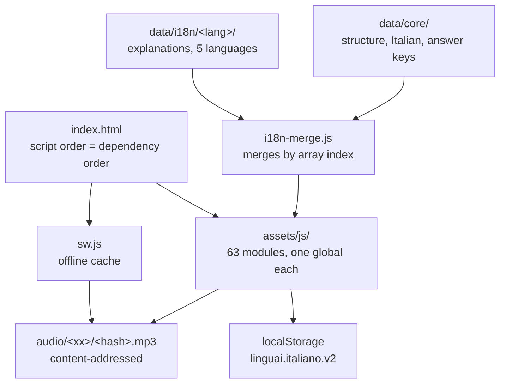

**English** | [Italiano](./README.it.md) | [Polski](./README.pl.md)

# Impara l'Italiano

A static Italian course, A1 to C2, that runs entirely in the browser: no account, no server, no build step, and nothing to install.


150 lessons, 1514 exercises and 3494 recorded Italian sentences, explained in the learner's own language. Open `index.html` and the course runs.

The grammar syllabus goes level by level from A1 to C2. Explanations exist in five languages (Polish, English, Spanish, French, German) and the learner picks one at any time, without losing progress. Everything the learner does stays in their browser. Two things can leave the device, and both are off until the learner turns them on: a voice recording sent for speech recognition, and an answer the course has already rejected, sent to a language model the learner pays for with their own key.

**Live:** [andreabonn.github.io/impara-italiano](https://andreabonn.github.io/impara-italiano/)

## Contents

- [What is in the repository](#what-is-in-the-repository)
- [Tech stack](#tech-stack)
- [Architecture](#architecture)
- [Repository structure](#repository-structure)
- [Prerequisites](#prerequisites)
- [Installation](#installation)
- [Running locally](#running-locally)
- [Quality gates](#quality-gates)
- [Adding course content](#adding-course-content)
- [The audio pipeline](#the-audio-pipeline)
- [The optional model check](#the-optional-model-check)
- [Deployment and CI](#deployment-and-ci)
- [User manual](#user-manual)
- [Security](#security)
- [License](#license)
- [Support the project](#support-the-project)

## What is in the repository

| Item | Count |
|---|---|
| Units / lessons / exercises | 32 / 150 / 1514 |
| Vocabulary entries | 1412 |
| Exercise types | 14 |
| Spoken conversations | 14 |
| Grammar reference entries | 42 |
| Reading texts / writing tasks / minimal-pair sets | 12 / 6 / 5 |
| Recorded sentences | 3494 mp3, 45 MB |
| Explanation languages | 5, 740 interface strings each |
| Engine files | 63 files, 11 881 lines |

Regenerate these numbers with `node scripts/validate.mjs`.

Beyond the lessons themselves the course carries a spaced-repetition deck (FSRS for vocabulary, SM-2 for the mistake notebook), rule-generated drills that never run out, a full verb conjugator covering fourteen tenses, a CILS B1 exam simulation with per-section timers, and a coverage screen that measures the learner against the most frequent word forms in Italian.

## Tech stack

**Application (shipped to the browser)**

- Plain ES5+ JavaScript, classic scripts, one global per file. No framework, no bundler, no polyfill.
- CSS in a single stylesheet, colors in OKLCH.
- Fraunces and Inter, self-hosted as woff2 (280 KB, SIL Open Font License). The page loads nothing from a third-party domain; the only requests that ever leave it are the two optional ones, speech recognition and the model check.
- Service worker for offline use, plus a web app manifest for installation.

**Toolchain (development only)**

- Node.js 24 for the scripts and the unit tests (`node:test`, `node:vm`).
- Playwright 1.63 for the browser tests, ESLint 10 for correctness, axe-core 4.13 inside the accessibility tests.
- Python via `uv` for the recording build, which needs `ffmpeg` and network access to Edge TTS.

`package.json` exists for the test toolchain. `index.html` loads nothing from it, and the course runs without `npm install`.

## Architecture

Two rules explain most of the layout. Course data is separate from the engine, and inside the data, what is Italian is separate from what the learner reads in their own language.



An Italian sentence exists in exactly one place, in `data/core/`. Recording file names are hashes of that sentence, so they cannot drift between languages, and adding a sixth explanation language generates no new audio at all.

The engine keeps pure functions apart from anything that touches the browser. The pure half is checked by `node:test` for almost nothing; the other half needs Playwright. That boundary decides whether a module gets split. File length does not: `store.js` and `verbs-data.js` stay whole because breaking them up would separate things that have to agree with each other.

## Repository structure

```text
index.html              application shell; script order is the dependency graph
sw.js                   offline strategy, version fingerprinted from PRECACHE
manifest.webmanifest    installable web app metadata
assets/
  css/app.css           the entire visual system
  fonts/                Fraunces and Inter, self-hosted, with their OFL texts
  icons/                app icons, including a maskable one
  js/                   63 engine modules, one global object per file
data/
  core/                 language-neutral layer: structure, Italian, answer keys
  i18n/<lang>/          explanations in the learner's language (pl, en, es, fr, de)
  audio-index.js        sorted hashes of every sentence that has a recording
audio/<xx>/<hash>.mp3   recorded narration, generated
scripts/                validation, parity, coverage, mutation and build tooling
tests/
  unit/                 944 assertions in node:vm, no browser
  dom/                  263 Playwright assertions in Chromium
docs/                   user manual, English and Italian
```

## Prerequisites

Nothing is needed to run the course. A browser opening `index.html` is enough.

To run the tooling:

| Requirement | Version | Needed for |
|---|---|---|
| Node.js | 24 or newer | scripts, unit tests, Playwright |
| Python via `uv` | 3.10 or newer | building the recordings |
| ffmpeg | any recent | building the recordings |

Node 24 rather than 20: `npm test` hands the glob `tests/unit/**/*.test.mjs` straight to `node --test`, which only accepts it from Node 21 on.

## Installation

1. Clone the repository.

   ```bash
   git clone git@github.com:AndreaBonn/impara-italiano.git
   cd impara-italiano
   ```

2. Install the development dependencies. Skip this if you only want to use the course.

   ```bash
   npm install
   ```

3. Install the browser Playwright drives.

   ```bash
   npx playwright install --with-deps chromium
   ```

## Running locally

Open `index.html` from disk and the course works, with two limits the browser imposes: speech recognition needs a secure context, and the service worker will not register on `file://`.

For everything to work, serve it:

```bash
npm run serve          # http://localhost:8080
npm run serve -- 3000  # any other port
```

Use this server rather than `python3 -m http.server`. The latter serves stale scripts after you edit a file, so the page shows something that is no longer in the repository and you go looking for the bug in code you already fixed. `scripts/serve.mjs` answers `Cache-Control: no-store` and refuses to serve outside the project directory.

## Quality gates

Every gate below runs on `push` and on `pull_request`, cheapest first, so a data error reports in seconds instead of after a minute of browser tests.

| Command | Checks |
|---|---|
| `npm run lint` | correctness, not style. ESLint flat config, four blocks for four kinds of file |
| `node scripts/validate.mjs [lang]` | duplicate ids, exercise completeness, gaps against answers, language leaks into the neutral layer |
| `node scripts/parity.mjs` | that every language overlay has the same shape as Polish |
| `node scripts/check_precache.mjs` | that the service worker caches everything `index.html` loads |
| `node scripts/check_swversion.mjs [--napraw]` | that a new release has a fingerprint to announce itself with |
| `npm test` | 944 assertions, 40 files, engine logic in `node:vm` |
| `npm run test:mutations` | 53 deliberate mutations; each must turn a named test file red |
| `node scripts/coverage.mjs --min 99` | engine coverage, currently 99.3% |
| `npm run test:dom` | 263 assertions in Chromium, including contrast measured by the browser |
| `npm run test:all` | unit, mutations and DOM in one run |

Mutation testing answers the question coverage cannot. Coverage says a line executed; executing is not checking. An assertion like `assert.ok(!out.includes("js-play"))` passes over an empty result with full coverage and zero content, and three assertions written the day that gate was added turned out to be exactly that.

The contrast test measures color through the browser rather than a parser. The palette is OKLCH, and external accessibility tools read `oklch(0.31 0.035 350)` as an RGB triple and report a channel of 350: their number is an artifact, not a measurement. Here the color goes onto a 1x1 canvas and comes back as sRGB, so the engine does the conversion and the threshold is real.

The counts above are the ones the badges carry. After the gates, `node scripts/badges.mjs` reads the reports of those same runs and writes `badges/test-badge.json` and `badges/coverage-badge.json`, which the profile README reads as shields.io endpoints and CI refreshes on every push to `main`. The figures in this table are still typed by hand and still go stale between releases; the two on the badges cannot.

If `npm run lint` reports ESLint 6.4.0, a system-wide ESLint answered instead of the project one. Run `./node_modules/.bin/eslint .`.

## Adding course content

A unit lives in two files with the same name, one per layer.

In `data/core/` goes everything Italian, everything that checks an answer, and the structure:

```js
LINGUAI.addUnits("A1", [{
  id: "a1-u11", icon: "🚲", titleIt: "In bicicletta",
  tags: ["g-preposizioni"],
  lessons: [ /* … */ ],
  test: { /* … */ }
}]);
```

In `data/i18n/<lang>/` goes only what the learner reads in their own language, in the same order:

```js
LINGUAI.addStrings("pl", {
  "unit:a1-u11": { title: "Rowerem po mieście", grammarNote: "przyimki ruchu" },
  "lesson:a1-u11-l1": { title: "…", theme: "…", objectives: [ /* … */ ] }
});
```

Arrays merge **by index**, so both sides must hold the same number of elements. A contrastive note ("in your language this works differently") is written from scratch for each language rather than translated: what traps a Polish speaker is often irrelevant to an American one.

Then run the gates:

```bash
node scripts/validate.mjs
node scripts/parity.mjs
```

Two rules the validator enforces that are easy to trip over. The neutral layer must contain no word in the learner's language, so a construction label is written in Italian (`dopo aver + participio`) and so is an exercise prompt (`Colloquiale:`). And every lesson needs at least one `tags` entry naming a real id from `GRAMMAR_REF`, because that is how the mistake notebook labels what went wrong.

After adding a file to `assets/js/` or `data/core/`, add it to `PRECACHE` in `sw.js`. `check_precache.mjs` fails the build if you forget, and `check_swversion.mjs --napraw` refreshes the fingerprint.

## The audio pipeline

Course sentences are recorded rather than synthesized in the browser. On Linux the Web Speech API usually reaches for espeak-ng, which sounds mechanical, and quality on other systems is unpredictable. A backend would have fixed that, at the price of the course no longer being static.

```bash
node scripts/extract_strings.mjs                    # collect sentences from data/core/
uv run --script scripts/build_audio.py --dry-run    # how many files are missing
uv run --script scripts/build_audio.py              # generate only the missing ones
```

File names are FNV-1a 64-bit hashes of the sentence text, computed by `audio_hash()` in Python and by `Recordings.hash()` in `assets/js/recordings.js`. Changing one requires changing the other, or every recording becomes unreachable. Because the name comes from the content, an unchanged sentence keeps its file and repeated runs produce no git churn.

Two voices: `it-IT-IsabellaNeural` narrates, `it-IT-GiuseppeMultilingualNeural` plays the other speaker in dialogues.

When you add a minimal pair, run `uv run --script scripts/check_minpairs.py`. The voice honors accents unevenly: `pèsca` and `pésca` get different files, but `vènti` and `vénti` come back byte-identical, and a pair nobody can hear apart teaches guessing. Nothing on screen, in the code or in the tests would show it.

## The optional model check

Open answers are judged by comparing text, so a sentence that is correct but worded differently gets rejected. A language model can give that judgement a second opinion, and the learner supplies the key.

Nothing is on by default. Without a key, without consent, or with the page opened from disk, `Llm.available()` is false and the course behaves as it did before the feature existed: same verdicts, same score, not one outbound request.

**What the model is allowed to do.** It is asked only about an answer the course has already rejected, and its reply reaches the exercise through `LlmRules.clamp`, as `ok || promote`. No path turns an accepted answer into a rejected one. A model that answers nonsense, answers in the wrong language, or is compromised outright produces a missing promotion, which is the course as it behaves today. The guarantee is in the code rather than in the prompt, so it survives a swap of provider.

**Four providers, keys on the device.** Google Gemini, Groq, OpenAI and Anthropic, each the middle tier of its vendor rather than the top one: the question is closed, the essay is a beginner's, and the learner pays for every call. They paste the keys they already have in Settings and set the order; the cascade asks the first provider that has a key and moves on only when that one fails. A rejected key retires its provider for the session and says so once. A timeout says nothing at all, because the local verdict is already correct and an optional feature failing mid-exercise is noise.

Keys live in their own `localStorage` container, `linguai.llm.v1`, which `store.js` does not know about. `exportState` serialises the whole profile into the backup file learners are told to keep, and a credential billed to their card does not belong in a file they are encouraged to carry around. Erasing the profile erases the keys with it.

**Budgets.** Three seconds for one provider, eight for the whole chain, sixty requests per session. Verdicts are cached for the session and never written to disk, where they would accumulate the learner's own sentences to save a request that may never be repeated.

**A second use, pointed the other way.** The writing screen offers a button that asks for a reading of the whole composition. That answer changes no score, no card and no progress, so there is nothing to clamp: it comes back as prose and is drawn as text. The two prompts are written in opposite directions. The judge answers a closed question and refuses when in doubt, because a wrong sentence accepted is a wrong sentence practised. The reader has no verdict to get wrong, so caution buys it nothing: it quotes and commits, because a polite generality costs money and teaches nobody anything.

| File | What is in it |
|---|---|
| `llm-providers.js` | the four vendors as data: url, headers, body, and how to read what came back |
| `llm-prompts.js` | what gets asked, which changes for reasons of teaching |
| `llm-rules.js` | the cascade, the parsing and the clamp, which change for reasons of engineering |
| `llm-keys.js` | the keys, structurally outside the state |
| `llm-net.js` | the request, its clock, and the walk down the chain |
| `llm.js` | three ways in (`judge`, `review`, `test`) behind the protocol, consent and budget gates |

The first three files are pure functions and are checked by `node:test` without a key and without a browser, with the transport injected. Eighteen of the mutation gates live there, the first of them being the one that breaks the clamp and requires `tests/unit/llm-rules.test.mjs` to turn red. `connect-src` in `index.html` names those four hosts and nothing else, which makes the CSP the honest statement of where this page can send anything.

## Deployment and CI

`.github/workflows/ci.yml` runs the eleven gates listed above on Node 24 with a Chromium install.

The site is published on GitHub Pages from the root of `main`, so every push redeploys. There is no build step: what is in the repository is what the browser receives.

Releases announce themselves rather than taking over. A new service worker waits in `waiting` until the page asks the learner about it, because without a build step file names carry no hash and a silent takeover would leave an open tab running old code against new files. The version is `v35.<12 hex>`, where the fingerprint is a hash of the `PRECACHE` contents written by `check_swversion.mjs --napraw` and guarded in CI, so a fix in `core.js` cannot ship as a release nobody sees.

## User manual

The manual for learners is in `docs/`, in both languages:

- [User manual (English)](./docs/USER-MANUAL.md)
- [Manuale utente (italiano)](./docs/MANUALE-UTENTE.md)

The course also ships a shorter guide inside itself, under the "How to use it" tab.

## Security

The course has no server, no account and no third-party request. What that leaves, and what it does not, is documented in [SECURITY.md](./SECURITY.md), along with how to report a vulnerability.

One thing worth stating here: speech recognition sends a recording of the learner's voice to their browser vendor's server. It is the only outbound traffic in the whole course, it is gated behind explicit consent, and refusing it turns the affected exercises into written ones.

## License

Code is released under the MIT License. Course content, including the recordings, is released under CC BY-SA 4.0. See [LICENSE](./LICENSE) and [LICENSE-CONTENT](./LICENSE-CONTENT).

The fonts are third-party work under the SIL Open Font License, whose texts travel with them in `assets/fonts/`. The frequency list is derived from the [Tatoeba Project](https://tatoeba.org) under CC BY 2.0 FR, and that attribution is required.

## Support the project

If the course was useful to you, a star on [GitHub](https://github.com/AndreaBonn/impara-italiano) helps other learners find it.

Impara l'Italiano is free to use. If you want to give something back, you can leave a tip via PayPal. The amount is up to you and it is entirely optional.

<div align="center">

[](https://paypal.me/AndreaBonacci19)

</div>
