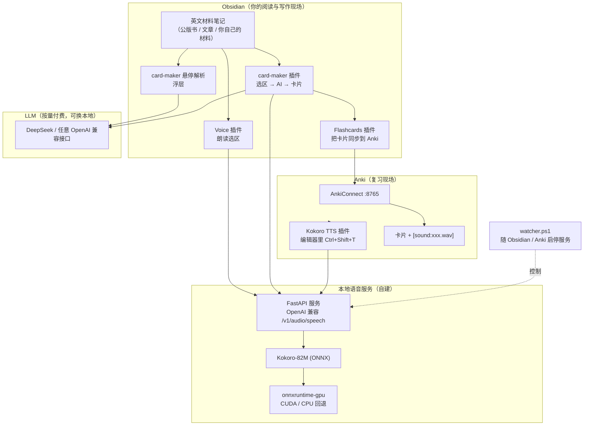

# 用你喜欢的英文材料学英语 · 本地 TTS + AI 制卡 + Anki 全自动流水线

> 把「读英文材料」变成一个**听得见、记得住、能复习**的闭环。
> 全程本地化 + 按量计费的云端 LLM，**一次搭好、长期复用**。

---

## 目录

- [0. 这套东西能做什么](#0-这套东西能做什么)
- [1. 架构总览](#1-架构总览)
- [2. 组件清单](#2-组件清单)
- [3. 前置条件](#3-前置条件)
- [4. 安装](#4-安装)
  - [4.1 本地 TTS 服务（Kokoro）](#41-本地-tts-服务kokoro)
  - [4.2 随用随启：守护脚本](#42-随用随启守护脚本)
  - [4.3 Obsidian 侧：让笔记会说话](#43-obsidian-侧让笔记会说话)
  - [4.4 card-maker 插件：一键制卡](#44-card-maker-插件一键制卡)
  - [4.5 Anki 侧：接收与复习](#45-anki-侧接收与复习)
  - [4.6 可选：鼠标侧键](#46-可选鼠标侧键)
- [5. 日常使用流程](#5-日常使用流程)
- [6. 实测数据](#6-实测数据)
- [7. 仓库结构](#7-仓库结构)
- [8. 常见坑（重要）](#8-常见坑重要)
- [9. 许可与说明](#9-许可与说明)

---

## 0. 这套东西能做什么

| 场景 | 操作 | 结果 |
| --- | --- | --- |
| **听读** | 选中一段英文 → 快捷键 | 本地 GPU 合成语音，**秒级出声、完全免费** |
| **复听** | 一个键 | 回退 3 秒 / 变速 / 换音色；最近 10 段有内存缓存，重读**零等待** |
| **查词** | 鼠标停在单词上 ~0.6 秒 | 光标旁浮层：词性、中文释义、英文释义、例句+翻译，可点击发音 |
| **制卡** | 选中一个词/一句话 → 一个键 | AI 判断是"生词"还是"句子"，自动释义/造句/标出难词，写入卡片笔记 |
| **同步** | 自动 | 卡片进 Anki，**音频一并上传**，正面自带发音 |
| **复习** | Anki 里正常复习 | 卡片有声音、有释义、有来源链接 |

设计目标：**降低"动手成本"到接近零**——不打断阅读的连贯性。

---

## 1. 架构总览



**为什么这样切分：**

- **TTS 完全本地**：朗读是高频动作，走云会又慢又贵；本地 GPU 合成一次约 0.13× 时长。
- **LLM 走云端**：制卡/解析是低频动作，用按量付费的大模型质量更高，也不用常驻显存。
- **服务随用随启**：模型只在需要时占用显存，不用时释放给游戏/其他任务。

---

## 2. 组件清单

| 组件 | 作用 | 安装方式 |
| --- | --- | --- |
| [Obsidian](https://obsidian.md) | 读写英文材料的现场 | 官网 |
| [Voice](https://github.com/chrisurf/obsidian-voice)（社区插件） | 朗读选区、播放器、变速 | 社区插件市场 |
| [Flashcards](https://github.com/reuseman/flashcards-obsidian)（社区插件） | 用 `Q::A` 语法写卡并同步到 Anki | 社区插件市场 |
| **card-maker**（本仓库） | 选区 → AI → 写卡 → 触发同步；悬停查词 | 复制 `plugin/card-maker/` 到 `.obsidian/plugins/` |
| [Anki](https://apps.ankiweb.net) | 复习 | 官网 |
| [AnkiConnect](https://ankiweb.net/shared/info/2055492159) | Anki 的本地 API | Anki 内安装 |
| [Kokoro TTS for Anki](https://github.com/Reagent992/anki_kokoro_extension) | 在 Anki 编辑器里给字段配音 | 手动放入 addons21 |
| **本地 TTS 服务**（本仓库 `code/`） | OpenAI 兼容的语音接口 | 见 4.1 |
| [Kokoro-82M](https://huggingface.co/hexgrad/Kokoro-82M) ONNX | 语音模型本体 | 见 4.1 |
| [uv](https://github.com/astral-sh/uv) | 快速建 Python 环境 | 官网一行命令 |
| DeepSeek（或任意 OpenAI 兼容 LLM） | 生成释义/例句/难词 | 官网注册 |
| [AutoHotkey v2](https://www.autohotkey.com/)（可选） | 鼠标侧键 → 快捷键 | 官网 |
| [Syncthing](https://syncthing.net/)（可选） | 多设备同步笔记与卡片 | 官网 |

> **可替换**：TTS 服务只要实现 OpenAI 的 `POST /v1/audio/speech`，换成其它引擎（Piper、Qwen3-TTS、云端 MiniMax…）也能直接接；LLM 也是同一个道理。

---

## 3. 前置条件

- **Windows 10/11**（脚本为 PowerShell；思路可移植到 macOS/Linux）
- **Python 3.10–3.12**（推荐用 `uv` 自动拉一个 3.12，避免和系统 Python 冲突）
- **NVIDIA 显卡（可选但强烈建议）**：6–8 GB 显存即可；没有 GPU 也能跑 CPU，只是慢约 6 倍
- **Obsidian 桌面版**、**Anki 桌面版**
- 一个 **OpenAI 兼容的 LLM API Key**（本文示例用 DeepSeek；也可用本地 Ollama，见 4.4）

> 磁盘：模型约 340 MB，CUDA 运行库约 2 GB（若复用系统已有的 CUDA 则不需要额外下载）。

---

## 4. 安装

### 4.1 本地 TTS 服务（Kokoro）

#### ① 建目录与虚拟环境

```powershell
# 选一个不在同步盘里的目录（避免几万个文件被同步）
mkdir E:\tts\kokoro-tts
cd E:\tts\kokoro-tts

uv venv --python 3.12
uv pip install --python ".venv\Scripts\python.exe" kokoro-onnx soundfile fastapi uvicorn
```

#### ② 下载模型（约 340 MB）

从 `thewh1teagle/kokoro-onnx` 的 Release（tag `model-files-v1.0`）下载两个文件，放进 `models\`：

- `kokoro-v1.0.onnx`（约 310 MB）
- `voices-v1.0.bin`（约 27 MB）

```powershell
mkdir models
$base = 'https://github.com/thewh1teagle/kokoro-onnx/releases/download/model-files-v1.0'
curl.exe -L -C - -o models\kokoro-v1.0.onnx "$base/kokoro-v1.0.onnx"
curl.exe -L -C - -o models\voices-v1.0.bin "$base/voices-v1.0.bin"
```

> **中国大陆用户**：GitHub 直连可能超时。可在 URL 前加一个镜像前缀，例如
> `curl.exe -L -C - -o models\kokoro-v1.0.onnx "https://<镜像>/https://github.com/.../kokoro-v1.0.onnx"`
> （镜像会变动，请自行选择当前可用的）

#### ③ GPU 加速（可选）

CPU 也能跑，实测 **RTF ≈ 0.83**（24.9 秒音频要算 20.6 秒），偏慢；上 GPU 后 **RTF ≈ 0.13**（约 6.3 倍）。

```powershell
uv pip uninstall --python ".venv\Scripts\python.exe" onnxruntime
uv pip install --python ".venv\Scripts\python.exe" onnxruntime-gpu
```

**关键：ONNX Runtime 版本必须和你的 CUDA 版本匹配。**

| onnxruntime-gpu | 需要 |
| --- | --- |
| 1.30 | CUDA **13** |
| 1.22（推荐） | CUDA **12** + cuDNN **9** |

如果机器上已经装了 PyTorch（比如 Anaconda 环境里），通常**已经有 CUDA/cuDNN 运行库**，把它们拷到一个独立目录即可，无需安装完整 CUDA Toolkit：

```powershell
# 例：从 Anaconda 与 torch 里抽取所需 DLL
mkdir cuda_dlls
copy "E:\anaconda\bin\cublas64_12.dll","E:\anaconda\bin\cublasLt64_12.dll",`
     "E:\anaconda\bin\cudart64_12.dll","E:\anaconda\bin\cufft64_11.dll" cuda_dlls
copy "E:\anaconda\Library\bin\curand64_10.dll" cuda_dlls
copy "E:\anaconda\Lib\site-packages\torch\lib\cudnn*64_9.dll" cuda_dlls
```

`server.py` 会自动把 `cuda_dlls\` 加进 DLL 搜索路径，**不需要污染系统 PATH**。

#### ④ 放进服务端代码并启动

把本仓库 `code/server.py` 复制到 `E:\tts\kokoro-tts\server.py`，然后：

```powershell
.\.venv\Scripts\python.exe server.py
```

验证：

```powershell
curl.exe http://127.0.0.1:8880/health
# {"status":"ok","provider":"CUDAExecutionProvider"}
```

也可用仓库里的 `code/start_kokoro.ps1`（幂等：已在运行则直接返回）。

#### ⑤ 常用音色

`am_michael`（美音男）、`af_heart` / `af_bella`（美音女）、`bm_george`（英音男）、`bf_emma`（英音女）等，共 28 个；`GET /v1/audio/voices` 可列出全部。

---

### 4.2 随用随启：守护脚本

把 `code/watcher.ps1`、`code/install_watcher.ps1`、`code/status.ps1` 复制到 `E:\tts\kokoro-tts\`，然后：

```powershell
.\install_watcher.ps1
```

它会：

1. 结束旧的守护进程；
2. 在「启动」文件夹建快捷方式（登录后自动运行，隐藏窗口）；
3. 立刻启动一次。

`watcher.ps1` 的逻辑（可自行改 `$watchProcs`）：

```
只要 Obsidian 或 Anki 任一在运行  → 保持 TTS 服务在线
两者都关闭                        → 停掉服务，释放显存
```

状态查看：`.\status.ps1`

---

### 4.3 Obsidian 侧：让笔记会说话

1. 社区插件市场安装 **Voice**。
2. `设置 → Voice`：

| 项 | 值 |
| --- | --- |
| Speech Provider | **OpenAI-compatible** |
| Base URL | `http://127.0.0.1:8880/v1` |
| Model | `kokoro` |
| Voice | `am_michael`（或你喜欢的） |
| Format | **`wav`** |
| API Key | 留空（本地服务不需要） |

3. 点 **Test Credentials**，能列出音色即成功。

> **为什么选 wav**：本服务默认返回 WAV；写成 mp3 会把 WAV 存成 `.mp3` 导致 Anki 放不出声。

4. `设置 → 快捷键` 里给这些命令绑键（推荐统一用 `Alt+`）：

| 快捷键 | 命令（搜 `Voice`） |
| --- | --- |
| `Alt+S` | Play or Stop reading the current document |
| `Alt+←` / `Alt+→` | Rewind / Fast-Forward |
| `Alt+↑` / `Alt+↓` | Increase / Decrease speed |
| `Alt+N` | Switch to the next speaker |
| `Alt+P` | Open the player |

**用法**：在**编辑/实时预览模式**下选中一段英文 → `Alt+S`。阅读模式没有选区，会读整篇。

#### 可选补丁：最近 10 段内存缓存

`code/voice-patches.md` 记录了如何给 Voice 插件打两处补丁（本地缓存 + MiniMax 域名修正），让"重读同一段"**零等待**。属于进阶项，不打也能用。

---

### 4.4 card-maker 插件：一键制卡

把本仓库 `plugin/card-maker/` 整个复制到 `<你的库>/.obsidian/plugins/card-maker/`，然后在 Obsidian 里启用。

#### 配置（`设置 → Card Maker`）

| 项 | 建议值 | 说明 |
| --- | --- | --- |
| API Base URL | `https://api.deepseek.com/v1` | 任意 OpenAI 兼容接口 |
| API Key | 你自己的 | 只存在本库的插件数据里 |
| 模型 | `deepseek-chat` | 不思考、快（实测单卡 0.6–1.0 秒） |
| 卡片目录 | `English/卡片` | 卡片笔记放这里 |
| 生词 / 句子文件名 | `生词.md` / `句子.md` | |
| 生成后自动同步 | 开 | |
| 同步延迟 | 4000 ms | 连续建卡时防抖，避免被 Flashcards 的"同步进行中"跳过 |
| 为英文自动生成音频 | 开 | 走本地 Kokoro，音频随卡片进 Anki |
| 悬停解析 | 开 | 悬停 600 ms 出浮层 |
| 句子卡·难词数量上限 | 3 | 句子卡自动加粗难词并附释义；填 0 关闭 |

#### 快捷键

| 快捷键 | 命令 |
| --- | --- |
| `Alt+W` | Card Maker: 从选区生成卡片 |

#### 用法

1. 在笔记里选中一个**单词**或**一句话**；
2. 按 `Alt+W`；
3. AI 自动判断类型：
   - 生词 → `word::词性 释义｜例：…｜例句翻译｜[[来源]]`
   - 句子 → `原句（难词加粗）::中文翻译｜难词：…｜[[来源]]`
4. 插件自动配发音、写入卡片笔记、触发同步 → Anki 里出现新卡。

**悬停解析**：鼠标停在英文单词上约 0.6 秒 → 光标旁浮层显示解析，带 🔊 发音与"＋卡"按钮。

#### 想改用本地 LLM？

在设置里把 Base URL 改成 `http://127.0.0.1:11434/v1`、模型填你在 Ollama 里拉的名字即可。

> 实测提醒：**不要用思考型模型**（如 `qwen3:4b`）——Ollama 目前的 `think:false` 关不掉它的思维链，一个词会烧掉上千 token。用 `qwen2.5:7b` 这类普通指令模型：约 53 tok/s，单卡 0.7–0.9 秒。

---

### 4.5 Anki 侧：接收与复习

#### ① AnkiConnect

`工具 → 插件 → 获取插件`，输入代码 **`2055492159`**，重启 Anki。

默认配置即可（`127.0.0.1:8765`，无 API Key）。Flashcards 2.0.1+ 不需要改 CORS。

#### ② Flashcards（Obsidian 侧）

| 设置 | 值 |
| --- | --- |
| Sync scope → Included folders | `English/卡片`（**务必限定，否则整库都会被扫**） |
| Default deck | 你喜欢的牌组名 |
| Inline 语法 | 开（`::` 基础、`:::` 反向） |

**卡片语法速查：**

```markdown
word::释义                      ← 基础卡
句子:::翻译                      ← 反向卡（双向）
The ==mitochondria== is ...     ← 填空（Cloze）
## 标题 #card                     ← 标题卡（标题是问题，下面是答案）
内容 #card-reminder              ← 无答案的提示卡
```

#### ③ 给 Anki 装 Kokoro TTS 插件（可选）

把 [Reagent992/anki_kokoro_extension](https://github.com/Reagent992/anki_kokoro_extension) 复制到 `%APPDATA%\Anki2\addons21\kokoro_tts\`，并**按 4.5 的坑修正配置**（见 [常见坑](#8-常见坑重要)）。

配置要点：

```json
{
  "voice": "am_michael",
  "api_url": "http://127.0.0.1:8880",
  "autostart": "false",
  "path_to_kokoro_executable": "",
  "audio_format": "wav",
  "shutdown_by_timer": "false",
  "idle_timeout_in_seconds": 120
}
```

用法：Anki 编辑器里选中字段中的文字 → `Ctrl+Shift+T` → 生成 `[sound:...]` 并自动播放。

---

### 4.6 可选：鼠标侧键

把 `code/obsidian-sidebutton.ahk`（AutoHotkey v2）放进启动文件夹：

- **靠近手心**的侧键 → `Alt+S`（朗读/停止）
- **远离手心**的侧键 → `Alt+W`（制卡）
- 用 `#HotIf WinActive("ahk_exe Obsidian.exe")` 限定，只在 Obsidian 生效，浏览器里的"后退/前进"不受影响

> 鼠标侧键是**鼠标事件**，Obsidian 的快捷键录制器只认键盘事件，所以必须这样"翻译"一层。

---

## 5. 日常使用流程

```
① 读：打开英文材料，选中一段 → Alt+S 听（本地合成，秒级）
       听不懂 → Alt+← 回退复听；太快 → Alt+↓ 降速

② 查：鼠标停在生词上 0.6 秒 → 浮层看释义 → 点 🔊 听发音

③ 收：选中该词 → Alt+W → 自动生成带发音的卡片

④ 复习：Anki 里按计划复习，卡片正面自带发音与释义

⑤ 循环：读下一章
```

**关键心法：把"查词/制卡"的摩擦降到接近零**，你才会真的去做。这套流水线里，一次制卡 ≈ 一个按键 + 等 1 秒。

---

## 6. 实测数据

测试机：RTX 4060 Laptop（8 GB 显存）+ Windows 11

| 项 | 数值 |
| --- | --- |
| Kokoro（CPU） | RTF ≈ **0.83** |
| Kokoro（CUDA） | RTF ≈ **0.13**（约 **6.3×** 加速） |
| 显存占用（TTS 常驻时） | 约 0.5–1 GB |
| DeepSeek `deepseek-chat` 生成一张卡 | **0.6–1.0 秒**，40–60 输出 token |
| 本地 `qwen2.5:7b`（Ollama） | **53 tok/s**，单卡 0.7–0.9 秒，占约 5.3 GB 显存 |
| 本地 `qwen3:4b` | ❌ 不可用（思考链关不掉，一个词 > 1000 token） |

**成本**：TTS 完全免费；LLM 按量计费，以 DeepSeek 为例，一张卡的成本约为**千分之几分钱**量级。

---

## 7. 仓库结构

```
diandu-english/
├─ README.md                     ← 本教程
├─ TROUBLESHOOTING.md            ← 踩坑与排查
├─ LICENSE
├─ .gitignore
├─ code/
│  ├─ server.py                  ← OpenAI 兼容的 Kokoro TTS 服务
│  ├─ start_kokoro.ps1           ← 手动启动（幂等）
│  ├─ watcher.ps1                ← 随 Obsidian/Anki 启停服务
│  ├─ install_watcher.ps1        ← 安装登录自启
│  ├─ status.ps1                 ← 状态自检
│  ├─ obsidian-sidebutton.ahk    ← 鼠标侧键映射（AHK v2）
│  └─ voice-patches.md           ← Voice 插件补丁说明（可选）
└─ plugin/
   └─ card-maker/
      ├─ manifest.json
      ├─ main.js
      ├─ styles.css
      └─ data.example.json       ← 配置样例（无任何密钥）
```

---

## 8. 常见坑（重要）

> 完整的排查手册见 **[TROUBLESHOOTING.md](TROUBLESHOOTING.md)**，这里列最关键的几条。

1. **JSON 不要带 BOM**。用 PowerShell 5.1 的 `Set-Content -Encoding utf8` 写配置会加 BOM，Python 的 `json.load` 会直接报"配置为空"。→ 用无 BOM 写入（`[System.IO.File]::WriteAllText($p,$s,(New-Object System.Text.UTF8Encoding($false)))`）。

2. **Flashcards 的行内卡片按"段落"解析**：卡片之间**必须有空行**，否则整段会塌成一张卡，背面吞掉后面所有内容。

3. **不要在 Anki 里手动给"来自 Obsidian 的卡"加音频**。Anki 侧被改动后与笔记内容分叉，Flashcards 会判定"这张卡已不在笔记里"并弹删除确认。

4. **删除确认不要点 "Keep them"**：取消会中止整次同步，导致新卡永远建不进去，形成"每次都弹窗"的死循环。

5. **ONNX Runtime 与 CUDA 版本必须匹配**（1.22 ↔ CUDA 12；1.30 ↔ CUDA 13），否则报 `Failed to create CUDAExecutionProvider`。

6. **DirectML 不可用**：Kokoro 的 `ConvTranspose` 算子 DML 不支持，会报参数错误。用 CUDA 或 CPU。

7. **第三方插件补丁会被更新覆盖**：本仓库对 Voice / Kokoro-Anki 插件的修改在插件升级后会丢失，升级后需重新应用。

8. **同类"记忆阅读位置"的插件只装一个**，否则互相抢着恢复位置；**不要装用 `Alt+←/→` 做导航的插件**（会和朗读回退/前进冲突）。

9. **国内网络**：GitHub 直连常常超时，用镜像前缀下载模型；pip 可换清华源。

---

## 9. 许可与说明

- 本仓库的脚本与插件代码以 **MIT** 发布（见 [LICENSE](LICENSE)）。
- 本仓库**不包含**任何英文材料原文；请自行使用你有权使用的材料（公版书、自己购买/订阅的材料、自己写的文本等），并遵守相应许可。
- 涉及的第三方组件（Obsidian 及其插件、Anki 及其插件、Kokoro 模型等）遵循各自许可。
- 本地 TTS 模型为 Kokoro-82M（Apache-2.0）；本仓库仅提供服务封装与集成脚本。

---

**如果这套流程帮到了你，欢迎把你自己踩的坑提 Issue / PR，让下一个人少走弯路。**
