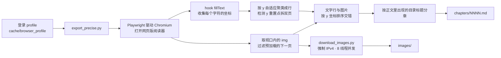
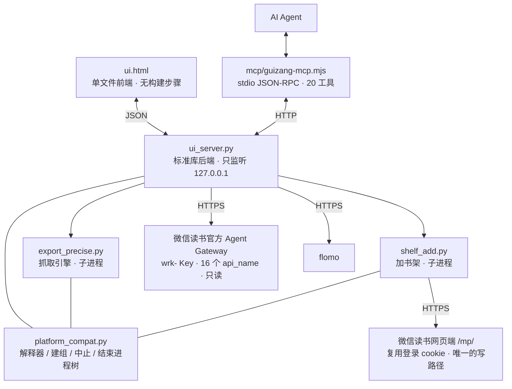

# 归藏 · weread-guizang

**你没见过的微信读书。** 把微信读书官方那套只给 AI Agent 用的 skills，还原成开箱即用的本地工具，并补上它没做的那些事。

> 二次开发自 [lbq110/weread-exporter](https://github.com/lbq110/weread-exporter)：抓取引擎与图片下载来自上游，界面、官方接口集成、MCP 与 skills 是后加的。授权状况见文末[来源与许可](#来源与许可)。

## 这是什么

微信读书官方把阅读数据做成了一套 **skill**：一个 Agent Gateway，配上 `skill_version` 与一组 `api_name`（书架、书城搜索、书籍详情、划线、想法、阅读统计、推荐……）。但它有两个硬边界——

- **只读**：白名单里没有任何写接口，加不了书、动不了书架
- **只服务 Agent**：普通人拿不到一个能点的界面

归藏把这套 skill 还原成能用的东西：

1. **官方 skill 有的，做成界面**：我的书架、书城搜索、书籍详情、阅读统计、为我推荐、全部划线与我写下的想法，都在本地网页里点得到。
2. **官方 skill 没有的，自己补**：正文导出（hook Canvas 拿字）、图片下载、把书加进自己的书架——官方网关不提供，就复用登录态调网页端接口。
3. **官方 skill 只给 Agent 用，这里两边都给**：给人一套界面，给 Agent 一套 MCP 适配器与 skills（零依赖 Node，20 个工具）。

三件事都在本机完成，服务只监听 `127.0.0.1`，不经第三方服务器。

## 它解决了什么麻烦

“新时代下的AI学习”

## 现在它可以

- 📚 **一键导出整本书为 Markdown** —— 文字与插图按阅读顺序精确交错，插图 8 线程并发补齐，逐章落盘、支持断点续传
- 🔍 **无需打开微信读书，直接搜索与查看导读** —— 书城搜索、书籍简介、作者出版社分类、阅读进度与最近阅读时间，都在本地看
- 📥 **搜到即抓，支持笔记检索** —— 搜索结果直接转成导出任务；全部划线建一份索引后可全文检索
- 🎲 **随机翻阅旧笔记，支持 Anki 导出** —— 「随机漫步」从全部划线里抽卡；划线导成 `.apkg`，页面内也能直接卡片回顾
- 🔌 **支持 MCP，连接 MCP Agent 快速学习** —— 20 个工具，长任务不阻塞；服务没起时适配器自己拉起来
- 🛜 **支持笔记一键迁移到 flomo** —— 多选划线批量转发，原文用「」包住，附书名与标签
- 🌍 **配套专为读书与学习开发的 skills** —— 仓库内 [`skills/`](skills/) 直接可装；界面里还有「一键建立 MCP」，把接入提示词复制给你的 Agent 即可

## 快速开始

两条路选一条：**直接下载 Mac 程序**，或者**自己从源码跑**。

### 一、直接下载 Mac 程序

[**下载 归藏-0.9.1.dmg**](安装包/归藏-0.9.1.dmg)（2 MB，macOS 13 以上，Intel 与 Apple 芯片都行）

1. 双击 dmg，把里面的 **归藏.app** 拖进「应用程序」。

2. **第一次打开**：注意看说明文档。

   如果它不给「打开」这个选项，而是直接弹 **「归藏」已损坏，无法打开。你应该将它移到废纸篓。** —— 那不是文件坏了，是 macOS 对没签名应用的默认说辞。打开「终端」，粘这一行，回车，再打开就正常：

   ```bash
   xattr -dr com.apple.quarantine /Applications/归藏.app
   ```

   装在别的位置就把路径换成实际位置；提示 `Operation not permitted` 就在最前面加 `sudo`。不想开终端的话，去 **系统设置 → 隐私与安全性**，往下滚到「安全性」，找到刚被拦下的那条，点「仍要打开」。

3. 第一次进去是首启页，点一下「我思故我在」。它会自己建虚拟环境、装依赖、下 Chromium（约 370MB，需要能连外网；用代理的机器请在代理软件里打开「系统代理」，它会自动继承），然后弹出浏览器扫码登录。之后每次打开都是一秒进。

机器上要有 Python 3.9+，没有的话去 <https://www.python.org/downloads/> 装一个官方版，**装完不用重启**，回来再点一次就行。包内另有一份《首次打开必读.txt》；细节与替代做法在 [部署说明.md](部署说明.md) 第二节。

### 二、自己从源码跑（强烈推荐）

需要 Python 3.10+；要用 MCP 的话另需 Node（`node -v` 能出版本号即可）。

#### macOS / Linux

```bash
git clone https://github.com/KEQingFeng/weread-guizang.git
cd weread-guizang
python3 -m venv .venv
.venv/bin/pip install -r requirements.txt
.venv/bin/python -m playwright install chromium     # 约 368MB
.venv/bin/python ui_server.py --port 8770
```

也可以双击 `启动归藏.command`（自己认目录，缺虚拟环境就自动建、自动装依赖；已在跑则直接开界面）。

**或者让它变成一个真正的 Mac 程序**（双击就用）：

```bash
./shell/build_macos.sh          # 产出 dist/归藏.app
```

把 `dist/归藏.app` 拖进「应用程序」即可。外壳是 Swift + WKWebView 写的原生应用 ——
界面还是上面这套 `ui.html`，一行没改。第一次打开是首启页：点一下「我思故我在」，
它自己把缺的（虚拟环境、依赖、Chromium）补齐，扫码登录后直接进界面；之后每次打开
都是一秒进。不需要完整 Xcode，CommandLineTools 就够了。

数据落在 `~/Library/Application Support/归藏/`（虚拟环境、导出的书、缓存、登录态），
所以应用包本身保持只读、随便挪位置。

想直接发给别人用，打成 dmg：

```bash
./shell/make_dmg.sh             # 产出 ~/Desktop/归藏-<版本>.dmg
```

就是上面「一、直接下载 Mac 程序」里那份东西，包里带着《首次打开必读.txt》。

#### Windows

```bat
git clone https://github.com/KEQingFeng/weread-guizang.git
cd weread-guizang
py -3 -m venv .venv
.venv\Scripts\python.exe -m pip install -r requirements.txt
.venv\Scripts\python.exe -m playwright install chromium
.venv\Scripts\python.exe ui_server.py --port 8770
```

也可以直接双击 `启动归藏.bat`，等于把上面四步一次做完。

然后浏览器打开 <http://127.0.0.1:8770>。

### 首次使用

1. 左上角齿轮 → **连接账号** → 在弹出的浏览器窗口里用微信扫码（会话持久化在 `cache/browser_profile/`，之后自动复用）。
2. 填 **接口 Key**：微信读书网页版「设置 → 开放 API」，复制形如 `wrk-…` 的 Key 粘进去保存。存在本机 `cache/config.json`（权限 600），界面上只回显末 4 位。书架、笔记、统计、推荐、书城搜索、书籍详情都依赖它；没填也能用，只是书架里只列出本地已导出的书。
3. 想把划线导进 flomo，填 **flomo** 那一栏（flomo 网页版 → 设置 → API，形如 `https://flomoapp.com/iwh/xxxx/`），需要 flomo PRO。

界面里把导出叫「**取书**」，日志叫「**进展**」，已导出叫「**藏书**」——功能不变，只是名字换过。

## 命令行用法（可脱离界面）

```bash
# macOS / Linux
.venv/bin/python export_precise.py <书籍链接或ID>          # 链接会自动提取 ID
.venv/bin/python export_precise.py <ID> --headed          # 想看翻页过程
EXPORT_DEBUG=1 .venv/bin/python export_precise.py <ID>    # 卡住时每 60 秒倾倒 Python 栈

# Windows
.venv\Scripts\python.exe export_precise.py <书籍链接或ID>
.venv\Scripts\python.exe export_precise.py <ID> --headed
set EXPORT_DEBUG=1 && .venv\Scripts\python.exe export_precise.py <ID>
```

登录与加书架也可以单独跑：`login.py`（登录/检测登录态）、`shelf_add.py <书城 id>`。

## 接入 AI Agent（MCP）

仓库自带一个**零依赖**的 Node 适配器（`mcp/guizang-mcp.mjs`，stdio + JSON-RPC 2.0）。在 MCP 配置里加一项，路径换成你自己的归藏目录：

```json
"guizang": {
  "type": "stdio",
  "command": "node",
  "args": ["<归藏目录>/mcp/guizang-mcp.mjs"],
  "timeout": 180000,
  "env": { "GUIZANG_REPO": "<归藏目录>" }
}
```

Qoder CN 写在设置文件的 `mcpServers`；ZCode 写在 `config.json` 的 `mcp.servers`。配好重启 Agent（MCP 是启动时加载的，不像 skills 能热加载）。

适配器会自己找项目目录（顺序：环境变量 `GUIZANG_REPO` → 认「本文件就在项目 `mcp/` 下」→ 退回常见路径），也会按平台挑解释器（Windows 认 `.venv\Scripts\python.exe`，macOS / Linux 认 `.venv/bin/python`，都没有退回系统 `python`）。服务没起时会自己拉起来。

**20 个工具**，分四类：

| 分类 | 工具 |
| --- | --- |
| 书架与状态 | `shelf_list`、`app_status`、`task_log`、`book_files`、`folder_create`、`book_move` |
| 取书 | `book_fetch`、`task_stop`、`batch_fetch`、`account_connect` |
| 书与笔记 | `book_detail`、`search_books`、`notes_index`、`notes_search`、`notes_random`、`book_mark`、`shelf_add` |
| 导出 | `apkg_export`、`zip_export`、`cache_delete` |

两条使用上的硬约束，写在适配器的工具说明里，Agent 读得到：

- **取书是分钟到小时级的长任务**，`book_fetch` / `batch_fetch` 会**立即返回**，进度用 `app_status` / `task_log` 轮询。别在工具调用里等它跑完，否则一律超时。
- `shelf_add` 是唯一的写操作，它会动你真实的微信读书书架；`cache_delete` 默认只列不删，要带 `confirm=true` 才真删。

## 配套 skills

[`skills/`](skills/) 目录里是专为读书与学习写的 skill，把对应文件夹拷进你的 skills 目录即可（Qoder CN 是 `~/.qoder-cn/skills/`，其他平台放各自的 skills 目录）：

| skill | 干什么 |
| --- | --- |
| [`skills/guizang/`](skills/guizang/) | 把归藏接成读书助手：先看状态再动手，长任务只发起一次靠轮询、写操作只做明确要求的那一个；含找书→取书→划线检索→抽卡→导 Anki 的完整动作序列与排障口径 |
| [`skills/book-speedrun/`](skills/book-speedrun/) | 把一本书**一次讲透**：前导地图 → 核心讲义 → 全书串讲 → 一页速记 + 分层行动清单，每块末尾挂一条当场可执行的动手项。带一份完整填写样例 |

判据上有个分工：要**内容**（把书讲透、读完即用）走 `book-speedrun`；要**数据**（把书拿到本地、检索自己的划线、导 Anki）走 `guizang`。两个可以接力——先用归藏取书，再用 `book-speedrun` 讲透。

> `book-speedrun` 正文里提到的 `grace-coach`、`learn-from-materials`、`learn-anything-skill` 是同一生态里的其他 skill，**不在本仓库**，只是用来划清分工。

也可以走界面里的「**一键建立 MCP**」：它把接入提示词复制到剪贴板，粘给你的 Agent 就行。那份提示词里不含任何本机路径、用户名或端口，可以直接给别人用。

## 产物结构

```
output/
├── <书id>/
│   ├── chapters/NNNN.md      # 逐章正文，图文交错
│   ├── images/               # 插图 chXXXX_imgNN.jpg
│   ├── raw/NNNN.json         # 每章的图片 URL 与字数
│   ├── _catalog.json         # 目录章节标题（用于判定全书末尾）
│   ├── _progress.json        # 抓取进度（界面进度条的来源）
│   └── meta.json             # 书名/作者/是否导完
├── 书名.md                   # 合并稿（图片是相对路径，单拿它会断图）
└── 书名.apkg                 # Anki 卡包（划线导出）
```

合并稿的图片是相对路径 `images/…`，单独拷走会断图；界面里的「完整包」ZIP 已经把正文与图片平铺好了。

用 Typora / Obsidian 打开全本 `.md`，就是一本图文完整的书。

## 工作原理





抓取引擎里几个不太显然的决定，都在踩坑之后定下来的：

- **不再用顶栏标题分章**，改用「正文里实际绘制出来的目录标题」。顶栏每翻一页都在变，早期版本因此把整批内容都堆到一个标题下，其余小节只剩空壳。目录标题每个只出现一次，天然去重。
- **翻页只按方向键，不点正文中心**。那一下点击会触发微信读书的「回到上次阅读位置」，而从目录跳到开头并不会更新阅读记录，于是「点一下 → 等它稳 → 再跳回开头」永远收敛不了，表现就是开头几章整片丢失。
- **每轮翻页有硬超时**。Playwright 的 `page.evaluate` 默认没有超时，渲染进程一卡死调用就永久挂住；而且 `asyncio.wait_for` 对不响应取消的调用无效，必须用 `asyncio.wait` 拿到超时就直接返回，再杀浏览器把连接回收。
- **图片下载强制 IPv4**。macOS 上 urllib 默认先试 IPv6，路由不通时每张图要卡约 120 秒。

## 常见问题

**点「连接账号」没反应 / 某个按钮点了没反应。**
先看启动服务的那个窗口，它会打印实际的「解释器」与「浏览器」路径，这两行排障先看。真出错时后端不会掐断连接装死，会把异常与最后几行栈写进界面的「进展」栏，页面上也能看到红字。

**加书架失败，提示「登录超时」。**
网页端 `/mp/` 接口认两个 cookie：`wr_vid`（长期身份）与 `wr_skey`（约 30 天会话）。`wr_skey` 过期时服务端回 **HTTP 200** 但内容是 `{"errcode":-2012,"errmsg":"登录超时"}`——状态码骗人。用同一个 profile 打开任意微信读书页面，服务端会重新下发 `wr_skey`；脚本也会自己续期一次再重发。**这类报错请照抄服务端 `errmsg`，不要猜码值含义**（我第一版就猜错过，把「登录过期」写成了「可能需要订阅」，排查方向整个被带歪）。

**取书跑到一半「不动了」。**
每轮翻页有 45 秒硬超时，超时会重开浏览器续传，不会整场报废。想看得更细：`EXPORT_DEBUG=1` 每 60 秒倾倒一次 Python 栈；日志里每 10 页有一次心跳。另外会话切换时会有几十秒「看着不动」，那是设计内行为（判定 12 页无新内容 + 重开浏览器）。

**导出的章节数比目录少。**
正文靠 hook Canvas 取字，阅读器会复用已绘制的缓存，所以整本抓取本质上不保证 100%。引擎已按目录标题分章，并有断点续传——再跑一次通常能补齐。

**书架是空的。**
没填接口 Key。填上之后书架、笔记、统计、推荐都会出来；没填时本地已导出的书仍会列在书架里（否则它们就点不到任何操作）。

**搜索引擎搜不到这个项目？**
仓库名是 `weread-guizang`，项目自己叫「归藏」。

## 已知限制

- 需要有效的微信读书账号，并对目标书有阅读权限（无限卡或已购买）
- 部分出版社限制网页端阅读（显示「去 App 阅读」），这类书无法导出
- 抓取不保证 100%：阅读器会复用已绘制的缓存，部分页确实不触发 `fillText`；章节归属在两次导出之间也可能略有差异（绘制批次不同），但正文总量稳定
- 纯图廊章节图片密集时，图注与图的配对偶尔差一位；正文章节里图片相对段落的位置是准的
- 导出速度约每页 1.1 秒（同一本书 14 页 A/B 实测：固定等待 2.12s/页 → 画完即走 1.08s/页，逐页正文 14/14 完全一致）。再往下压就得缩短「等这一屏画完」的判定，会开始丢字，所以停在这里
- Canvas 逐字抓取对跨行断字仍会啃掉少量字符（如 `multi-agent` 被截成 `ulti`）
- 官方网关不开放「书单」接口，所以面板里没有书单，最接近的是「推荐」
- flomo 的请求格式官方未公开示例，这里按通行约定发 JSON、失败退回表单编码；**真实发送未经过验证**（没有可用的 webhook token 做端到端测试）
- 跨平台：Windows 上的分支已在单元测试里用 mock 平台标志跑过，但**没有在真 Windows 机器上端到端验证**

## 来源与许可

抓取引擎（`export_precise.py`、`download_images.py`）来自 [lbq110/weread-exporter](https://github.com/lbq110/weread-exporter)，在此之上做了二次开发。

**上游仓库没有声明任何开源许可证。** 因此这里不替上游做授权决定：上述文件的著作权与授权状态以上游为准，如果你要再分发或商用，请先向上游确认。

归藏新增的部分——`ui_server.py`、`ui.html`、`mcp/guizang-mcp.mjs`、`platform_compat.py`、`shelf_add.py`、`login.py`、`skills/`、`tools/`、启动脚本与文档——按 **MIT** 使用。

仓库根目录**刻意没有放 `LICENSE` 文件**：一份根 LICENSE 会覆盖整个仓库，而上游代码的授权不归这里决定。等上游明确授权后，再补一份合适的许可证更干净。

## 免责声明

仅供个人学习研究、以及备份**自己已购**的内容使用。请勿传播导出成果、勿用于商业用途，尊重著作权与平台服务条款。工具只监听本机回环地址，不会把你的账号、Key 或书籍内容发往任何第三方服务器。
